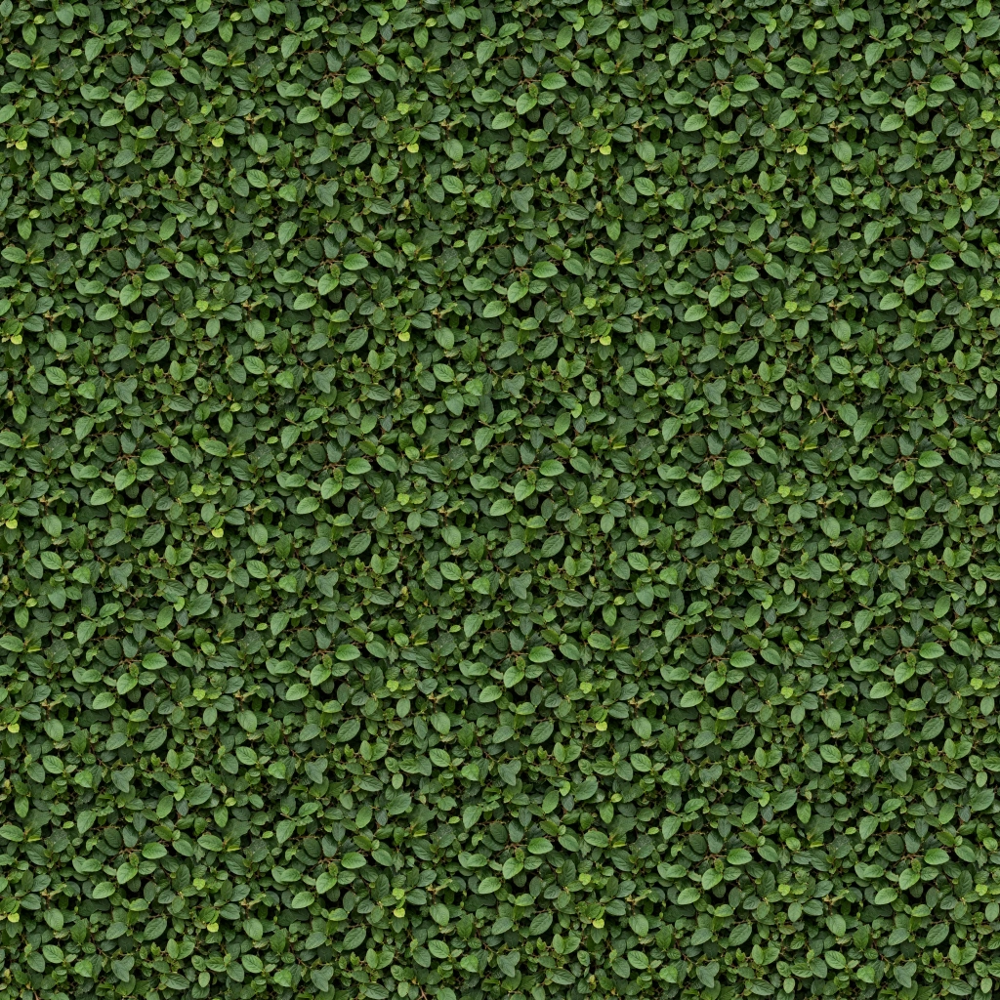
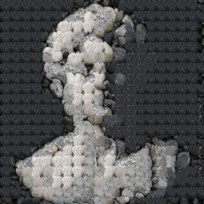

# Graphics Studies

Two browser experiments implementing patch-based image synthesis from Efros & Freeman’s **Image Quilting for Texture Synthesis and Transfer** (SIGGRAPH 2001).

- **Image quilting:** grow a texture by matching overlapping patches, then hide joins with minimum-error boundary cuts.
- **Texture transfer:** choose texture patches against a target intensity guide, refining the result with smaller patches over several passes.

[Image quilting on the portfolio](https://zachsm.com/studies/image-quilting) · [Texture transfer on the portfolio](https://zachsm.com/studies/texture-transfer) · [Original paper](https://www.merl.com/publications/docs/TR2001-17.pdf)




## Run

Requires Node 22 or newer. No runtime dependencies, server, account, or API key is required.

```sh
npm test
npm start
```

Open http://127.0.0.1:5182. Switch between the two studies in the navigation. Upload a source texture, upload a target for transfer, adjust patch size, overlap, candidate count and seed, then run. Save the completed output as PNG or inspect its patch boundaries. Cancellation terminates the worker immediately; a completed result remains available.

The portfolio imports this package’s **same lab UI, worker, and algorithm**, pinned to a commit. There is no second implementation hidden in the site.

## How it works

`src/seam.js` uses dynamic programming to find a minimum-cost connected path through a pixel-error grid. Left and top overlaps use the same solver with a transposed grid. Where both overlaps exist, the retained old-pixel regions are combined by union. This is not a global graph-cut solver.

`src/quilting.js` fills the output in raster order. It computes normalized RGB squared error in the overlap and randomly chooses among candidates within 10% of the best score. A deterministic seed controls both the candidate subset and tie selection. Edge patches are cropped to the output boundary.

Transfer adds squared error against a smoothed, independently normalized luminance guide. The structure control weights target agreement against texture continuity. After the first pass, the texture term also matches the preceding synthesized image; each subsequent pass reduces patch size by one third. Pixel colors are copied from the source, never recolored to match the target.

`src/worker.js` runs synthesis off the UI thread. Progressive frames are transferred at roughly 90 ms intervals. The output is bounded to 512 × 512 and source images are sampled at 256 × 256 in the UI. Uploaded files stay in the browser.

## Scope and limitations

- Candidate patches are a seeded, uniformly sampled subset of available source positions. Small inputs are searched exhaustively. This trades search quality for interactive CPU cost.
- Random, straight-overlap, and minimum-error-cut modes make the contribution of matching and seam placement visible.
- Repeated motifs remain possible, especially in uniform target regions. Texture detail and target structure compete; a high structure weight does not guarantee a faithful reconstruction.
- Opposite output edges are not constrained to match. These results are not guaranteed to be periodic tiles.
- This is a classical non-parametric method, not neural style transfer.
- Timings shown in the UI measure that browser run; they are not cross-device benchmarks.

## Verification

There are no GitHub Actions workflows in this repository. Run validation locally before opening and merging a pull request.

Node tests compare the seam solver to exhaustive path enumeration; check reproducibility, opaque coverage including cropped boundaries, input immutability and pixel provenance; verify transfer responds to target structure; and cover progress and invalid parameters. Portfolio browser tests exercise the actual worker, cancellation, uploads, seam overlay and PNG export.

See [asset provenance](docs/assets.md) for generated input photographs and reproducible example settings. MIT license applies to the implementation. Credit for the original method belongs to Alexei A. Efros and William T. Freeman.
