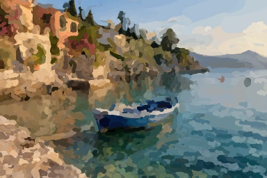
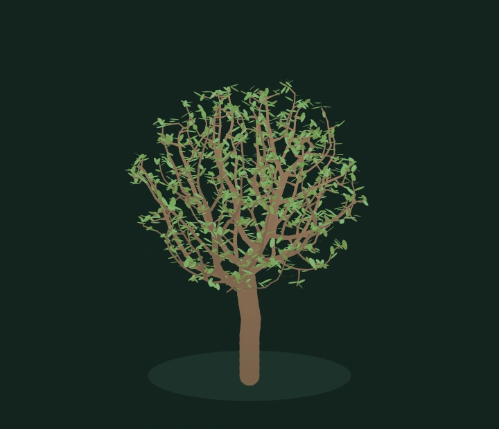
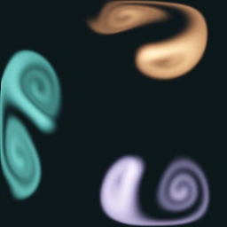
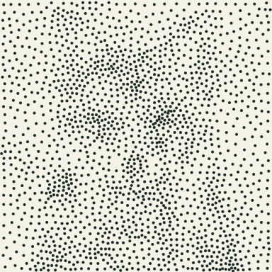

# Graphics Studies

Twelve small graphics experiments, built from research papers and running locally in a browser. Algorithms, worker execution, controls, examples, and tests live together in this repository. The portfolio imports the same implementation, pinned to a commit.

## Explore

| Study | Research | Live playground |
|---|---|---|
| Image quilting | [Efros & Freeman, 2001](https://www.merl.com/publications/docs/TR2001-17.pdf) | [Expand a texture](https://zachsm.com/studies/image-quilting) |
| Texture transfer | [Efros & Freeman, 2001](https://www.merl.com/publications/docs/TR2001-17.pdf) | [Transfer material](https://zachsm.com/studies/texture-transfer) |
| [Weighted stippling](web/assets/stippling-result.webp) | [Adrian Secord · 2002](https://lhf.impa.br/cursos/rr/p37-secord.pdf) | [Try it](https://zachsm.com/studies/stippling) |
| [Painterly rendering](web/assets/painterly-rendering-result.webp) | [Aaron Hertzmann · 1998](https://mrl.cs.nyu.edu/publications/painterly98/hertzmann-siggraph98.pdf) | [Try it](https://zachsm.com/studies/painterly-rendering) |
| [Seam carving](web/assets/seam-carving-result.webp) | [Shai Avidan & Ariel Shamir · 2007](https://cs.brown.edu/courses/cs016/static/files/docs/seamcarving_original_paper.pdf) | [Try it](https://zachsm.com/studies/seam-carving) |
| [PatchMatch completion](web/assets/patchmatch-result.webp) | [Barnes, Shechtman, Finkelstein & Goldman · 2009](https://gfx.cs.princeton.edu/pubs/Barnes_2009_PAR/) | [Try it](https://zachsm.com/studies/patchmatch) |
| [Moving least squares](web/assets/image-deformation-result.webp) | [Schaefer, McPhail & Warren · 2006](https://people.engr.tamu.edu/schaefer/research/mls.pdf) | [Try it](https://zachsm.com/studies/image-deformation) |
| [Space-colonization trees](web/assets/tree-growth-result.webp) | [Runions, Lane & Prusinkiewicz · 2007](https://algorithmicbotany.org/papers/colonization.egwnp2007.html) | [Try it](https://zachsm.com/studies/tree-growth) |
| [Stable Fluids](web/assets/stable-fluids-result.webp) | [Jos Stam · 1999](https://www.dgp.toronto.edu/public_user/stam/reality/Research/pdf/ns.pdf) | [Try it](https://zachsm.com/studies/stable-fluids) |
| [Hybrid images](web/assets/hybrid-images-result.webp) | [Oliva, Torralba & Schyns · 2006](https://doi.org/10.1145/1141911.1141919) | [Try it](https://zachsm.com/studies/hybrid-images) |
| [HDR tone mapping](web/assets/hdr-tone-mapping-result.webp) | [Frédo Durand & Julie Dorsey · 2002](https://people.csail.mit.edu/fredo/PUBLI/Siggraph2002/) | [Try it](https://zachsm.com/studies/hdr-tone-mapping) |
| [Image Analogies](web/assets/image-analogies-result.webp) | [Hertzmann, Jacobs, Oliver, Curless & Salesin · 2001](https://mrl.cs.nyu.edu/publications/image-analogies/) | [Try it](https://zachsm.com/studies/image-analogies) |






## Run locally

Requires Node 22+. The algorithms have no runtime dependencies, account, server processing, or API key.

```sh
npm test
npm start
```

Open http://127.0.0.1:5182. Every page has controls, a published example, and a live canvas. Uploaded images remain on the device. Expensive work runs in a cancellable Web Worker. The fluid simulation continues until paused, cancelled, or the page unmounts.

For optional browser verification and example regeneration:

```sh
npm install
npx playwright install chromium webkit
npm run test:browser
STUDIES_BROWSER=webkit npm run test:browser
npm run examples
```

Keep the local server running in another terminal. Browser tests are local-only; **GitHub Actions are disabled and there are no workflows**. The examples script writes lossless PNGs and WebP previews using the algorithms themselves, along with parameters in `web/assets/experiment-examples.json`.

## Implementation notes

- [Rendering: stippling, curved strokes, and seam carving](docs/rendering-studies.md)
- [Matching: PatchMatch, Image Analogies, and MLS](docs/matching-studies.md)
- [Simulation: trees, fluids, and hybrid frequencies](docs/simulation-studies.md)
- [HDR decoding and bilateral tone mapping](docs/hdr.md)
- [Asset origins and reproducibility](docs/assets.md)
- [Local validation](docs/validation.md)

These are independent, bounded studies—not complete replicas of every feature or optimization in the cited papers. The pages describe the approximations and failure cases. Neural networks are not used by the algorithms. Four source photographs were generated specifically for the examples; algorithm outputs are computed, not generated mockups.

## Existing quilting and transfer implementation

`src/seam.js` uses dynamic programming to find a minimum-cost connected path through a pixel-error grid. Left and top overlaps use the same solver with a transposed grid. Where both overlaps exist, the retained old-pixel regions are combined by union. This is not a global graph-cut solver.

`src/quilting.js` fills the output in raster order. It computes normalized RGB squared error in the overlap and randomly chooses among candidates within 10% of the best score. A deterministic seed controls both the candidate subset and tie selection. Edge patches are cropped to the output boundary.

Transfer adds squared error against a smoothed, independently normalized luminance guide. The structure control weights target agreement against texture continuity. After the first pass, the texture term also matches the preceding synthesized image; each subsequent pass reduces patch size by one third. Pixel colors are copied from the source, never recolored to match the target.

`src/worker.js` runs synthesis off the UI thread. Progressive frames are transferred at roughly 90 ms intervals, or 300 ms for outputs above 1024px to limit memory traffic. Quilting supports outputs up to 2048 × 2048; transfer remains bounded to 512 × 512. Source images are center-cropped and sampled at 256 × 256 in the UI. Uploaded files stay in the browser.

Quilting defaults to 240px patches (94% of the source width), 41px overlaps and a 1024px output: four times the source width and height, or sixteen times its area. There are 25 overlapping patch placements, with the outer row and column cropped to the output. Overlap scoring skips patch interiors, which do not affect synthesis matching. A full 256px patch has only one source position, so its seed and candidate count do not change the result. Transfer retains 36px patches and a 256px output by default because it needs smaller pieces to follow its target.

## Scope and limitations

- Candidate patches are a seeded, uniformly sampled subset of available source positions. Small inputs are searched exhaustively. This trades search quality for interactive CPU cost.
- Random, straight-overlap, and minimum-error-cut modes make the contribution of matching and seam placement visible.
- Repeated motifs remain possible, especially in uniform target regions. Texture detail and target structure compete; a high structure weight does not guarantee a faithful reconstruction.
- Opposite output edges are not constrained to match. These results are not guaranteed to be periodic tiles.
- This is a classical non-parametric method, not neural style transfer.
- Timings shown in the UI measure that browser run; they are not cross-device benchmarks.

## Distinct example sets

Every study owns its input images and computed outputs. Stippling starts with 8,000 dots and supports up to 20,000, with a 512px working image and SVG export. The architecture engraving example teaches Image Analogies a treatment from A/A′; it does not reuse the painterly study. [Image provenance and comparisons](docs/assets.md) explain the complete collection.
